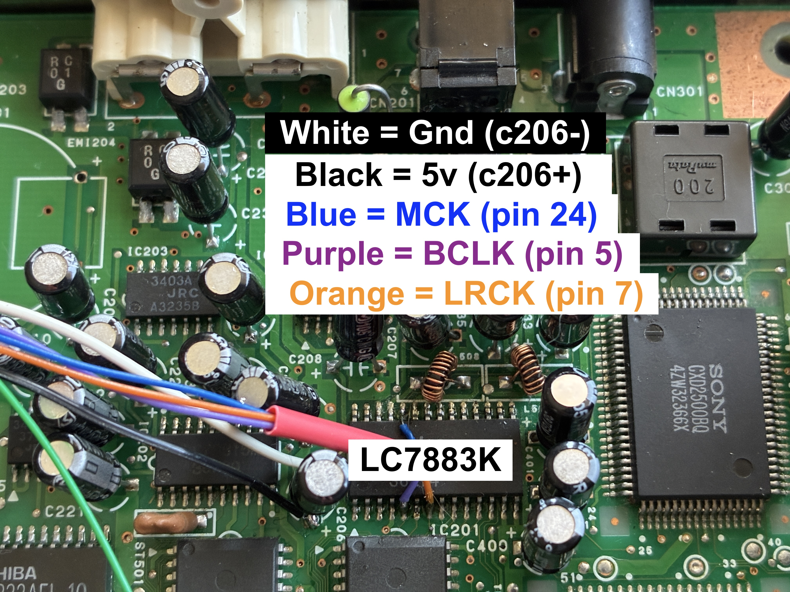
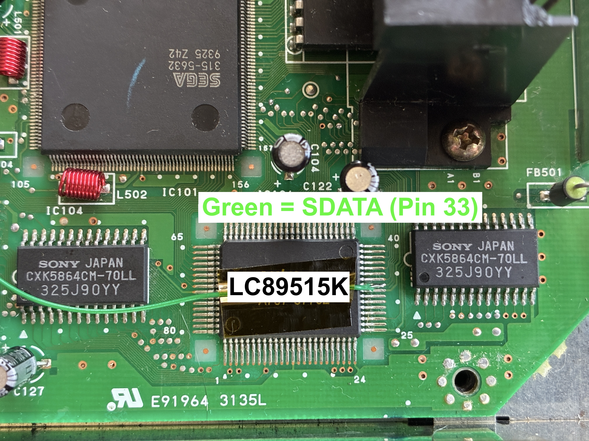
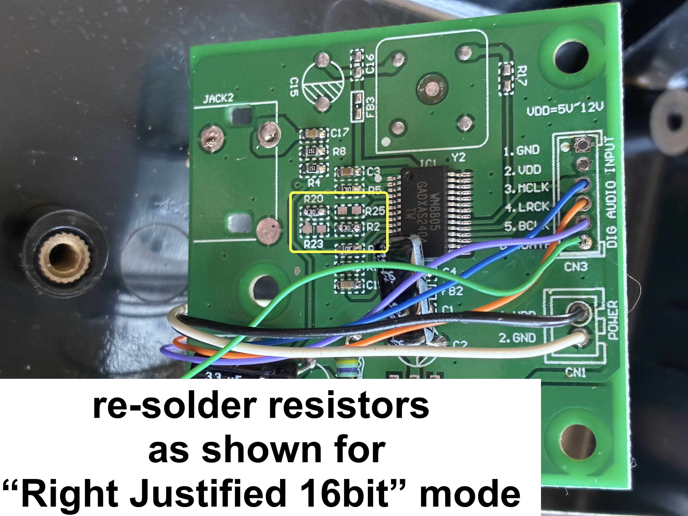
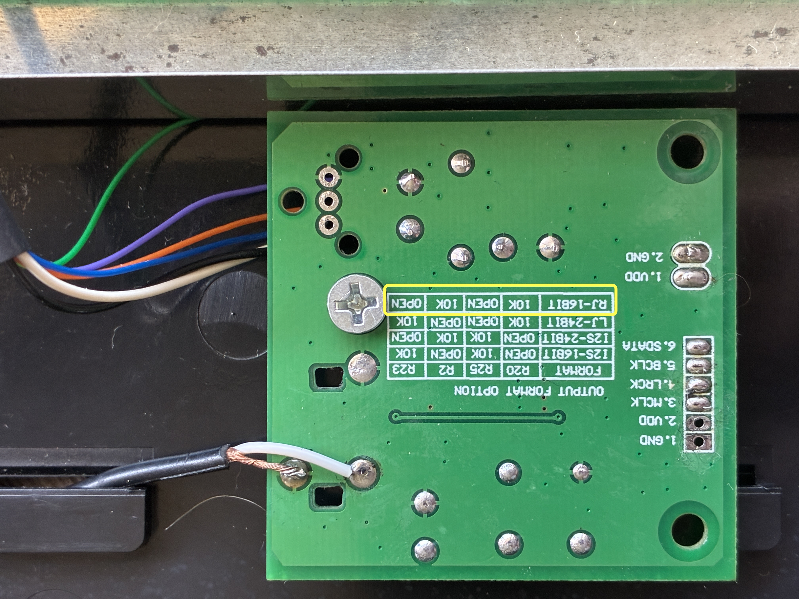

# SegaCD-CDDA
Extract Coax/SPDIF CD Audio from the Sega CD Model2 MK-4102A

**This is a rough guide on how to get digital CD audio from your Model 2 Sega CD.**

I really enjoy the CD Audio playback screen and have been using my Sega CD to play CDs for almost a year now. I wanted to see if I could get higher quality audio from the Sega CD by finding a digital source. To my knowledge, there are two streams of digital audio inside the Sega CD. CDDA and PCM, each having their own separate DACs. I was able to tap into the CDDA DAC (LC7883K) and find the pins responsible. Unfortunately it's not a single pin but multiples that are an I2S variant. Using a board based on the WM8805, I was able to convert this to a Digital SPDIF/Coax/Optical format that is used by External DACs of today. Here are my notes and some pictures as a rough guide, if you would like to do the same. Remember this digital signal is ONLY CD Audio. Listening to Sega CD games in this fashion, would be missing all of the PCM parts of the sound.

Notes:

 - Signals tapped are in Right Justified 16-bit format. Make sure to configure the WM8805 board to accept this by moving the appropriate resistors as shown on the board.
 - No cutting necessary. Routing "Spdif/Coax" (RCA) signal through slot in bottom of case and securing board with a screw to an existing mount.
 - I bought my [WM8805](https://www.aliexpress.us/item/3256807436033058.html?) board from AliExpress, but I'm sure you can find one like it elsewhere as well.

